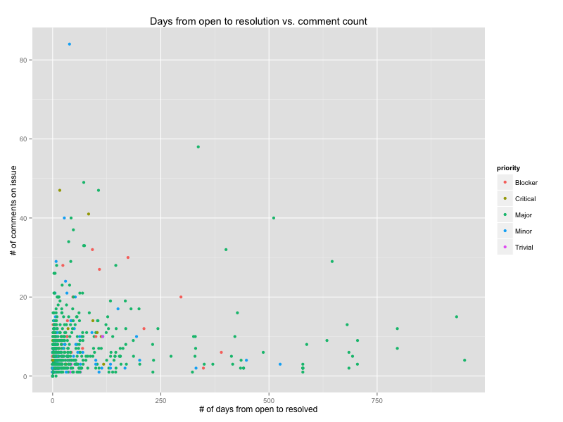

#JIRAVIEW
Can your JIRA instance do this?

Or this?

Neither can mine. That's why I have this project. It extracts the raw data from any JIRA instance (that has REST API support) and creates useful data files from it.

## How it works
The scripts talk to JIRA via the REST API and extract all data for issues that match a given [JQL](https://confluence.atlassian.com/display/JIRA/Advanced+Searching "JIRA advanced searching") query. The extracted data is inserted into a MongoDB instance. There is support for incremental syncing from JIRA to MongoDB. The data in MongoDB can be saved into several different types of files (see below).

An intermediate data store (MongoDB) is used because JIRA has relatively high response times and we want to be able to use all issue data at any time.

##What's in the box
There are several thing in here…
###python
The python folder contains the core scripts that perform data extraction and transformation.

### ansible
There is an Ansible playbook that can take a bare CentOS installation and install all dependencies required for running the jiraview scripts (i.e. Python + MongoDB), R and Jenkins, which we often use for scheduling things. With this setup you can create a machine that runs the JIRA extraction and R scripts to generate plots on a certain schedule.

### R
An example R script that generates a number of (not necessarily) useful plots from the CSV files.

## Using
(Assumes prior knowledge of python virtual environments and the virtualenvwrapper.)

In your favorite shell, take these steps:

	# Make sure you are running MongoDB on localhost without authentication required
	# The database name that will be used is 'jiraview'
	
	mkvirtualenv jiraview
	git clone git@github.com:godatadriven/jiraview.git
	cd jiraview/python
	
	pip install -r requirements.txt
	
	# Now we define a data set (for the Apache Wicket project)
	# Note tha {last_update} placeholder in the JQL query. This is required for incremental fetching.
	cd jiraview
	python dataset.py wicket \
	-jql 'project = Wicket and updatedDate > {last_update}' \
	-url 'https://issues.apache.org/jira/' \
	-collection wicket
	
	# Now we fetch all issues
	# -v is for verbose; if ommitted, you won't see any output
	# This will take a long time; if you run the fetch script again, it will do an incremental fetch
	python fetch.py wicket -v
	
	# Create a bunch of CSV files from the issues (see the R sample script for usage; column names are reasonably descriptive)
	python extract.py wicket -dir /tmp
	
	# You can now use the CSVs for your JIRA data needs.

Other available scripts are:

- jsondump.py, which will output a JSON file with all issue data (one JSON object per line; see the [JIRA REST API docs](https://docs.atlassian.com/jira/REST/latest/) for what's in there)
- xes.py, which create a XES XML file that can be used in the [ProM open source process mining tool](http://www.processmining.org/prom/start).

Use the -h option on each script to find all command line parameters.
